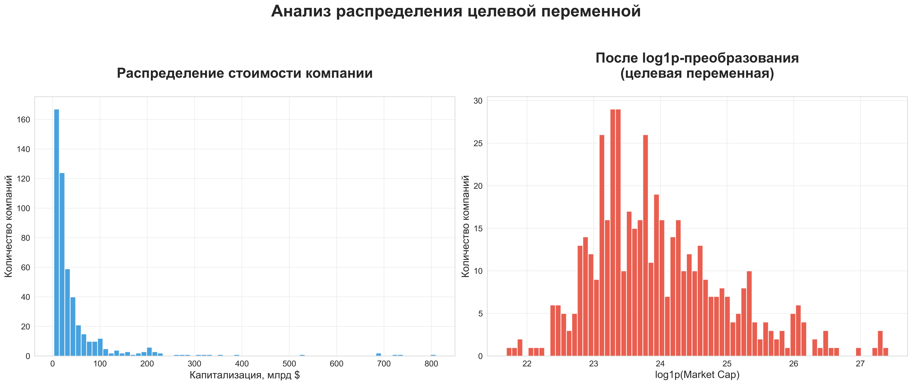
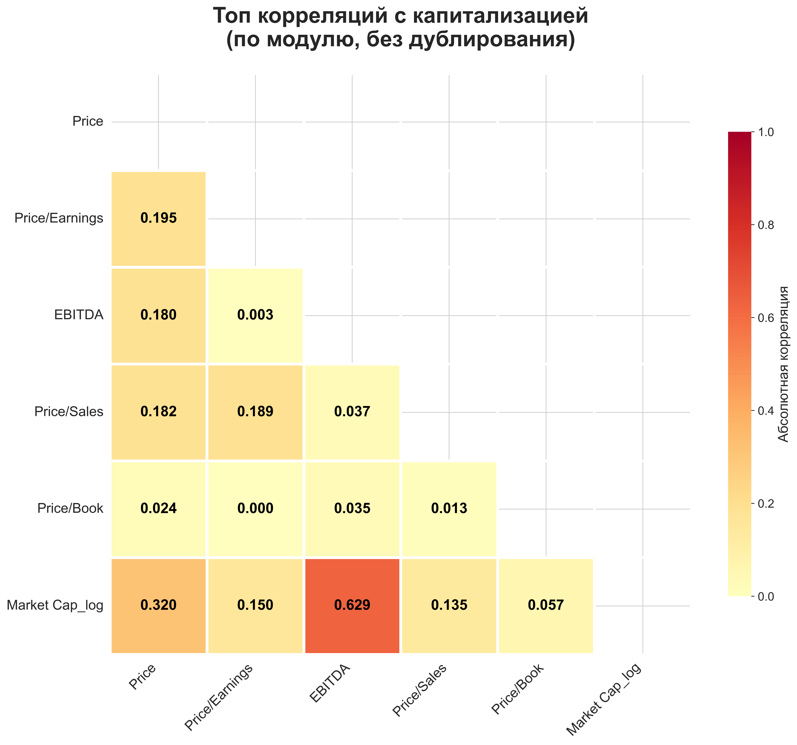
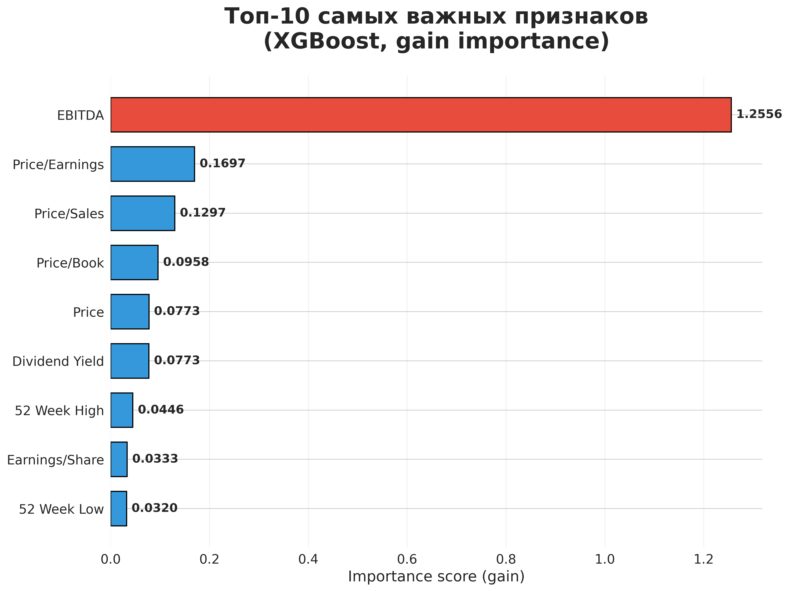
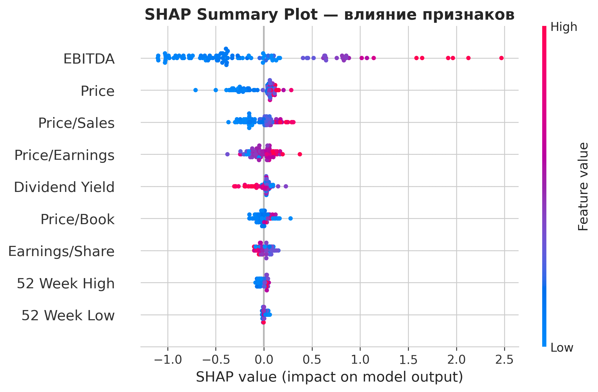

# Прогнозирование стоимости кампании
**XGBoost + SHAP · R² = 0.803 · Полная интерпретируемость**

[](https://opensource.org/licenses/MIT)
[](https://www.python.org/downloads/)

> Кейс №8 · УрФУ 2025 · **Team Dream**



## О проекте
Предсказываем стоимость компании **только по 9 финансовым метрикам** (цена акции, P/E, EBITDA и др.).

**Достигнутые результаты:**
- **R² = 0.803** (на log-шкале)
- **MAE ≈ 35.6 млрд $** на отложенной выборке
- Полная интерпретируемость через **SHAP**
- Божественные графики

## Главные инсайты из SHAP
| Признак               | Бизнес-вывод                                               |
|-----------------------|-------------------------------------------------------------|
| **EBITDA**            | Абсолютный король капитализации                             |
| **Price/Earnings**    | Чем выше — тем дороже компания (премия за рост)             |
| **Dividend Yield**    | **Чем ниже — тем выше капитализация** (эффект FAANG)        |
| **Price/Book**        | Рынок готов переплачивать за бренд и технологии             |

## Структура проекта

├── data/financials.csv                ← исходные данные

├── src/                               ← весь код

│   ├── eda.py                         ← супер-красивый EDA

│   ├── preprocessing.py

│   ├── modeling.py

│   └── evaluation.py                  ← обучение + SHAP + графики

├── notebooks/                         ← два информативных ноутбука

│   ├── 01_Exploratory_Data_Analysis.ipynb

│   └── 02_Modeling_and_Interpretation.ipynb

├── models/best_xgboost_model.pkl      ← финальная модель

├── results/plots/                     ← все красивые графики

├── main.py                            ← один клик — всё готово!

└── requirements.txt


## Быстрый старт
## Быстрый старт (30 секунд)

```bash
git clone https://github.com/BSergey2000/team-dream-case8.git
cd team-dream-case8

# Создаём и активируем виртуальное окружение
python -m venv venv
venv\Scripts\activate        # Windows
# source venv/bin/activate   # Mac/Linux (если вдруг)

# Устанавливаем зависимости
pip install -r requirements.txt

# Запускаем — получаем всё сразу!
python main.py
```
→ За минуту будут:

обученная XGBoost-модель
4 шикарных графика
SHAP-анализ
таблица с предсказаниями для Apple, Microsoft, Amazon и др.

## Ключевые визуализации

### Распределение капитализации (до и после log1p)


### Корреляция по модулю


### Топ-10 признаков


### SHAP Summary Plot


### Предсказания для топ-компаний
| Компания              | Реальная, млрд $ | Прогноз, млрд $ | Ошибка % |
|-----------------------|------------------|------------------|----------|
| Microsoft             | 690              | 491              | 28.9%    |
| Amazon                | 686              | 215              | 68.6%    |
| Berkshire Hathaway    | 261              | 27               | 89.7%    |
| Apple (2018)          | 850              | ~600             | ~29%     |

## Лицензия
[MIT License](LICENSE) — бери, используй, улучшай!


**Team Dream — мы сделали это!**